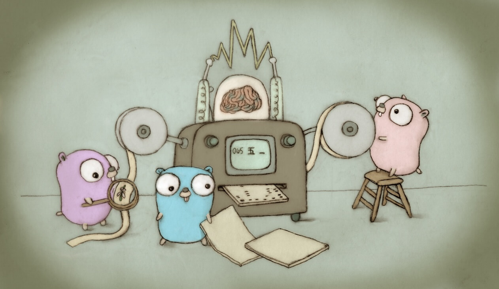

[separator=::]
= Coding from the Get Go
:author: Robert S. Muhlestein (rwxrob)
:creator: {author}
:copyright: 2024 Robert S. Muhlestein
:email: rob@rwx.gg
//:revnumber: v0.0.1
//:revdate: 2024-11-19
:revremark: Under development
:doctype: book
:leveloffset: +1
//:front-cover-image: 
:sectnums!:
:sectlinks:
:toc: left
:toclevels: 2
:toc-title: Table of Contents
:description: Learn practical computer science and programming with Go as a first language.
:keywords: golang computer-science compsci programming beginners
:icons: font
:xrefstyle: short
:source-highlighter: pygments
:pygments-style: vs
:pygments-linenums-mode: table

_Learn practical computer science and programming with Go as a first language_

This is the current running notes from the livestream sessions learning practical computer science and programming with Go as a first language.

include::copyright.adoc[]

= Preface

include::./get-the-tools.adoc[]

= Learn by doing

include::./learn-by-doing.adoc[]

include::../hello/README.adoc[]

//include::../world/README.adoc[]

//include::../bincount/README.adoc[]

//include::../arrrgs/README.adoc[]

//include::../greet/README.adoc[]

//include::../color/README.adoc[]

//include::../nyan/README.adoc[]

//include::../waffles/README.adoc[]

//include::../eightball/README.adoc[]

//include::../roll/README.adoc[]

//include::../lights/README.adoc[]

//include::../pre/README.adoc[]

//include::../toemoji/README.adoc[]

//include::../bridge/README.adoc[]

//include::../fizzbuzz/README.adoc[]

//include::../simon/README.adoc[]

//include::../quiz/README.adoc[]

//include::../madforms/README.adoc[]

//include::../vimtutor/README.adoc[]

//include::../story/README.adoc[]

//include::../pokeapi/README.adoc[]

//include::../serve/README.adoc[]

//include::../wschatserve/README.adoc[]

//include::../wschatclient/README.adoc[]

//include::../calc/README.adoc[]

//include::../colors/README.adoc[]

//include::../coding/README.adoc[]

== Hi there
:tags: variable, constant, type, primitive, slice, array, map, struct, scope, var, assignment, walrus-operator, block, subroutine, procedure, func, null, nil, identifier, blank-identifier fmt.Sprintf, function, scope, caller, paradigm, operator, operand, go-test, TDD, test-driven-development, _test.go, example-based-tests

- Block - anything within curly brackets
- Subroutine - any collection of steps or instructions within a block
- Procedure - specifically a collection of instructions in a subroutine
- Function - internal calculation with a specific output return value (like math)
- Scope - how visible a thing is to other things
- Caller - the thing that called the other thing
- Paradigm - how to look at the world
- Operator - performs some action on one or more operands
- Operand - involved in the the action of an operator

== Organize
:tags: module, package, file, go.mod, pkg, cmd, README.adoc, comment, markdown, asciidoc, godoc, adoc

- Package is the current directory name
- All `.go` files in directory as as if they were all in a single file
- Unit test files have `_test.go` (but more on that later)
- By convention, `main.go` contains `func main()` (also `package main`)
- All packages are either _commands_ or _libraries_
- Put library packages into `pkg`
- Put command packages into `cmd`
- A _module_ contains one or more packages
- Keep `go.mod` (which identifies the top of the _module_) at the root
- Regularly use `go mod tidy` to remove unused module dependencies
- Commit `go.mod` and `go.sum` in your GitHub repos
- Make sure command packages have good names
- Build binaries in same directory with `go build`
- Build binary with specific name with `go build -o hello`
- Install into `GOBIN` (in `PATH`) with `go install`
- Use `type hello` to see what is being run
- Use `hash -r` to reset to latest install
- Note that `go install` required full path to file `go install ./cmd/hello`
- Go is an _explicitly_ compiled language (like C)
- Comment a single line with `//`
- Comment multiple lines with `/* */`
- Create same-named file with `_test` for unit tests
- Add `// Output:` comment followed by expected output as `//` comment
- Run `go test` to check example-based unit test
- Learn basic Markdown
- Consider learning AsciiDoc

== Calculator

== Terminal colors
:tags: color, ansi, escape, terminal, tty, package, import

== Nyan cat

== How the world turns

== Magic eight ball

== Guess my number
:tag: term.Prompt

== Bridgekeeper

== FizzBuzz

== Arrrgs

== Binary counter

== ASCII table

== Dice roll
:tags: string, strings.Join, embed.FS

== Lights
:tags: string, strings.Join

== Simon
:tags: timer

== Madforms
:tags: structured-data, json, yaml, jq, yq, types, strings, numbers, booleans, arrays, maps, null, nil, directory

== Quiz game
:string: string, match, regular-expressions, regex

== Pokeapi

== Text adventure

- `panic`
- `defer`
- save game/cache
- goroutines
- `go test -race`

== Calculator

= Push a portfolio

== Bonzai branch

- `Exec`

== Bonzai completer

- `Testing.T`
- `ExampleTest`

== Bonzai persister

== Knowledge manager

== HTTP routeable server

== Serve HTTP REST endpoint

== Fetch JSON endpoint

== Websocket subscribe

== Link

== Scrap and walk HTML

== Descent into parsing

== Resume generator

== Static site generator

include::./whats-next.adoc[]
= What's next

_In development..._

